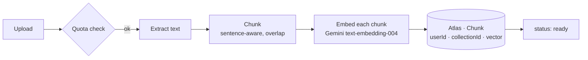
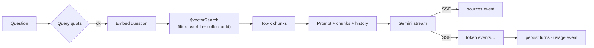

<div align="center">

# Retrivo Vault

**The research assistant that only knows what you've read.**

A production-grade, individual-focused Retrieval-Augmented Generation (RAG) SaaS.
Upload your contracts, papers and notes, ask questions in plain language, and get
answers that cite the exact passage they came from — nothing else, nothing invented.

[](https://github.com/Ahmadhsn1/Rag-saas-RetrivoVault/actions/workflows/ci.yml)
[](./LICENSE)
[](https://nodejs.org)
[](./CONTRIBUTING.md)

[Quick start](#quick-start) · [Architecture](#architecture) · [Why I built this](#why-i-built-this) · [Engineering notes](#engineering-notes-problems-i-ran-into) · [API](#api) · [Security](#security)

</div>

---

> Individuals only — no teams, workspaces, or org roles, by design.

Sign up (14-day Pro trial, no card), verify your email, drop your documents (PDF ·
TXT · Markdown · DOCX · CSV · **web pages by URL**) into a private vault, and ask it
anything through a streaming, citation-backed chat. Free / Pro / Max plans with
trial-aware quotas, Stripe billing, in-app + email notifications, an activity log +
data export, personal API keys, HMAC-signed webhooks, an OpenAPI spec, and a
lightweight admin console.

See [`retrivo-vault-architecture.md`](./retrivo-vault-architecture.md) for the full
system design and [`features.md`](./features.md) for the complete feature list.

---

## Why I built this

Everyone who works with documents ends up with the same pile: contracts, papers,
transcripts, reports — saved "for later," and later never comes. The pile doesn't
get smarter as it grows, it just gets heavier. Keyword search fails the moment you
don't remember the exact wording, and pasting a file into a general chatbot loses
everything the moment you close the tab — no memory across documents, no way to
check where an answer came from, and your text goes wherever that vendor's model
goes.

I wanted something narrower and more honest: a tool that only answers from what
you've actually given it, that shows the passage behind every claim instead of
asking you to trust it, and that says "not in your documents" instead of guessing.
Building it individual-only — no teams, no seats, no admin console gating features
behind a sales call — was a deliberate constraint, not a missing feature: it kept
the isolation model simple enough to reason about and verify, chunk by chunk.

That constraint is also why the whole system stays small enough to read end to end:
one ingestion pipeline, one retrieval path, one `userId` filter that every query
passes through. No hidden multi-tenant complexity to hide bugs in.

## Architecture

**Ingestion** — every document goes through the same pipeline, queued so a 200-page
PDF can't block anyone else's upload:



**Query** — a question never sees another user's documents; isolation is enforced
at the database index, not just in application code:



Full component breakdown, data models, and folder structure:
[`retrivo-vault-architecture.md`](./retrivo-vault-architecture.md).

## Engineering notes: problems I ran into

A few things that weren't obvious until they broke, and how they're handled now.

**Isolation can't be an afterthought in a RAG system.**
The whole point of a private vault falls apart if one user's question can ever
retrieve another user's chunk. Checking `userId` in application code is easy to get
right once and wrong the next time someone adds a query path. So the filter lives
in the MongoDB Atlas Vector Search index definition itself (`§6` of the architecture
doc) — retrieval is structurally incapable of crossing accounts, not just carefully
coded not to. Two adversarial test suites exist specifically to keep trying to break
this.

**Rotating refresh tokens are useless without reuse detection.**
A refresh token that just rotates on every use still leaves a window: if an old,
already-rotated token gets replayed (stolen and used after the legitimate client
already refreshed), a naive implementation just issues a new one. Refresh tokens
here are grouped into a `family`; replaying a token that's already been rotated past
its short retry-grace window revokes the *entire* family, not just that token — the
whole session line is killed rather than trusting a token that shouldn't exist
anymore.

**Streaming responses and error handling actively fight each other.**
Once an SSE response starts streaming tokens, you can't turn around and send a JSON
error with a normal status code — the headers are already sent. The first version
of the error handler didn't know that and threw secondary errors mid-stream on any
upstream hiccup. It now checks whether the response has already started streaming
and, if so, closes the stream cleanly instead of trying to write headers a second
time — every other route still gets a consistent 4xx mapped from whatever the
framework threw (bad JSON, a Mongo `CastError`, a payload-too-large, a bad JWT).

**Untrusted input reaches Mongo *and* the network — both needed hardening.**
Two separate classes of attack, two separate fixes: (1) request bodies are
sanitized against NoSQL-injection operators (`$`, dotted keys) and every user-
supplied string/id is coerced and validated before it touches a query; (2) personal
webhook URLs are user-supplied by design (HMAC-signed delivery to your own
endpoint), which makes them an SSRF vector — so delivery is HTTPS-only, blocks
private/loopback/cloud-metadata hosts, and never follows redirects.

**Ingestion is the one endpoint that takes untrusted *content*, not just untrusted
parameters.** A large or adversarial file could blow up memory during text
extraction before any chunk limit ever kicks in. Extracted-text length, chunks-per-
document, and queue depth are all capped, with the queue returning `503`
(backpressure) rather than accepting work it can't finish — the goal was to fail
predictably under load instead of degrading silently.

**Trial vs. paid vs. free logic wants to sprawl.** Every quota check needs to know
which plan actually applies right now, and "paid but expired," "on an active trial,"
and "never subscribed" are three different states that all need the same answer
shape. Collapsing that into a single `user.effectivePlan()` (paid > live trial >
free) meant every quota middleware calls one function instead of re-deriving plan
state at each call site — the kind of duplication that quietly drifts out of sync.

**Local dev shouldn't require a cloud database to click around.** Atlas Vector
Search isn't available in a local/in-memory MongoDB, which made "clone and try it"
painful — you needed a real Atlas cluster and a Gemini key just to see the UI. With
no `backend/.env` present, `npm run dev` now spins up an ephemeral in-memory Mongo
and runs in demo mode; every route works except vector retrieval and AI calls, which
fail with a clear `502` instead of a cryptic connection error until you plug in real
credentials.

---

## Stack

| Layer | Tech |
|---|---|
| Frontend | React + Vite + **TypeScript**, Tailwind, shadcn/ui (Radix), React Router, GSAP, Recharts |
| Design system | `frontend/design-system/retrivo-vault/` — dark developer-tool aesthetic (OLED canvas, warm bone accent, monospace status chips). Dark, JetBrains Mono + IBM Plex Sans. |
| Backend | Node.js + Express (ESM), SSE streaming, pino logging |
| Database | MongoDB Atlas + Atlas Vector Search (`$vectorSearch`, 768-dim cosine) |
| AI | Google Gemini `text-embedding-004` + `gemini-2.5-flash` |
| Auth | JWT access + **rotating** httpOnly refresh cookie · bcrypt · login lockout · `x-api-key` |
| Email | Nodemailer (SMTP; console fallback in dev) |
| Billing | Stripe Checkout + Customer Portal + webhooks (degrades gracefully when unset) |
| Ingestion | In-process job queue (concurrency, priority, retry, backpressure) |
| Tests / CI | Vitest (~115 tests, incl. adversarial hardening suites) · GitHub Actions |
| Deploy | Docker + Docker Compose |

---

## Quick start

```bash
cd backend  && npm install && npm run dev     # :5000 — works with ZERO config
cd frontend && npm install && npm run dev     # :5173 — proxies /api -> :5000
```

**Zero-config dev:** with no `backend/.env`, `npm run dev` starts an **ephemeral
in-memory MongoDB** and runs in demo mode (emails auto-verified, billing stubbed).
Every endpoint works except **vector retrieval** (needs Atlas) and **AI calls**
(need a Gemini key) — you get a clear `502` there until you configure them.

**Real setup:** `cp backend/.env.example backend/.env`, fill in `MONGO_URI` (a MongoDB
**Atlas** cluster — Vector Search is Atlas-only), `GEMINI_API_KEY`, and JWT secrets, then
`cd backend && npm run create-index`. Set `ADMIN_EMAILS=you@example.com` to unlock `/app/admin`.

**Checks:** `cd backend && npm test` · `cd frontend && npm run typecheck && npm run lint && npm test && npm run build`

### Routes

Marketing: `/` · `/pricing` · `/docs` · `/terms` · `/privacy` · `/s/:shareId` (public shared chat)
Auth: `/login` · `/signup` · `/forgot-password` · `/reset-password` · `/verify-email`
App: `/app` (Chat) · `/app/documents` · `/app/collections` · `/app/admin` ·
`/app/settings` (`?tab=profile|billing|notifications|keys|webhooks|activity|account`)

---

## Docker

```bash
cp backend/.env.example backend/.env      # fill in real values
docker compose up --build
docker compose run --rm backend npm run create-index   # once
```

App: http://localhost:8080 · API: http://localhost:5000/api. nginx serves the static
bundle and proxies `/api` (SSE-friendly). Containers run non-root with healthchecks.

---

## Plans & quotas

| | Free | Pro | Max |
|---|---|---|---|
| Documents · storage | 20 · 50 MB | 500 · 2 GB | 5,000 · 20 GB |
| Questions / month | 100 | 3,000 | 20,000 |
| Collections | 3 | 50 | 500 |
| BYO Gemini key · priority queue | — | ✓ | ✓ |
| API keys · webhooks · API access | — | — | ✓ |

Every signup gets a **14-day Pro trial** (`user.effectivePlan()`). Over-limit requests
return `402`/`403` with `details.code` (`quota_exceeded` / `feature_locked`); the UI
turns these into an "Upgrade" prompt.

---

## Optional integrations

- **Stripe** — `STRIPE_SECRET_KEY`, `STRIPE_WEBHOOK_SECRET`, four price IDs
  (`STRIPE_PRICE_{PRO,MAX}_{MONTHLY,ANNUAL}`). Local: `stripe listen --forward-to
  localhost:8080/api/billing/webhook`. Without a key, billing is disabled and everyone
  stays on Free.
- **Email** — `SMTP_URL`. Without it, emails print to the console.
- **`DEMO_MODE=true`** — auto-verify emails, stub billing (portfolio demos).
- **`ADMIN_EMAILS`** — comma-separated list granted `/api/admin/*`.

---

## API

Full surface in [`retrivo-vault-architecture.md`](./retrivo-vault-architecture.md) §7,
or the live spec at `GET /api/public/openapi.json` (rendered at `/docs`).
`/api/documents` and `/api/chat` also accept an `x-api-key` header (Max plan keys).

---

## Security

Rotating refresh tokens with reuse detection · per-account login lockout · `helmet` ·
credentialed CORS · rate limiting (auth/refresh/upload/chat) · **NoSQL-injection
sanitizer** + string/id coercion · every framework error mapped to a 4xx (no 500 on
bad input) · webhook SSRF protection (private/metadata hosts blocked) · ingestion
input caps (text length, chunk count, queue depth) · MIME + size checks before parsing,
in-memory only · every query scoped by `userId` (vector index included) · one-time
tokens & keys stored as SHA-256 hashes, TTL-indexed · Stripe webhook signature verified
against the raw body · no user enumeration on password reset · pino logging with secret
redaction · secrets via env. See [`SECURITY.md`](./SECURITY.md).

---

## Testing

~115 automated tests, run on every push via GitHub Actions:

- **Backend (~78 tests)** — Vitest + `mongodb-memory-server` + `supertest`, Gemini
  SDK mocked. Covers auth + refresh-token rotation/reuse, login lockout, email/reset/
  delete flows, trial-aware quota enforcement, billing, API keys, webhooks + SSRF,
  notifications, chat feedback/share/pin, admin, activity/export, ingestion end-to-
  end + input caps, and **two adversarial hardening suites** (malformed input never
  500s, cross-user isolation, injection attempts).
- **Frontend (~34 tests)** — Vitest + Testing Library (jsdom), GSAP + API mocked.
  Every route renders, including 404, error boundary, `/docs`, `/s/:id`, `/app/admin`.

---

## Roadmap

- [ ] Redis-backed rate limiter for multi-instance deployments (in-memory store
      documented as single-instance in [`SECURITY.md`](./SECURITY.md))
- [ ] Swappable ingestion queue backend (BullMQ + Redis) for horizontal scaling
- [ ] Additional file types (EPUB, HTML export)

Tracked as GitHub issues — see [Issues](https://github.com/Ahmadhsn1/Rag-saas-RetrivoVault/issues).

---

## Contributing

Bug reports, feature ideas and PRs are welcome — see [`CONTRIBUTING.md`](./CONTRIBUTING.md).
Please also read the [Code of Conduct](./CODE_OF_CONDUCT.md). Release notes live in
[`CHANGELOG.md`](./CHANGELOG.md).

## License

MIT — see [`LICENSE`](./LICENSE). Copyright © 2026 Retrivo Vault contributors.
