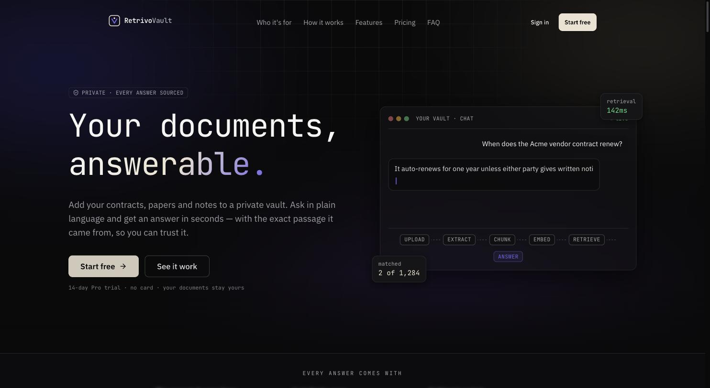
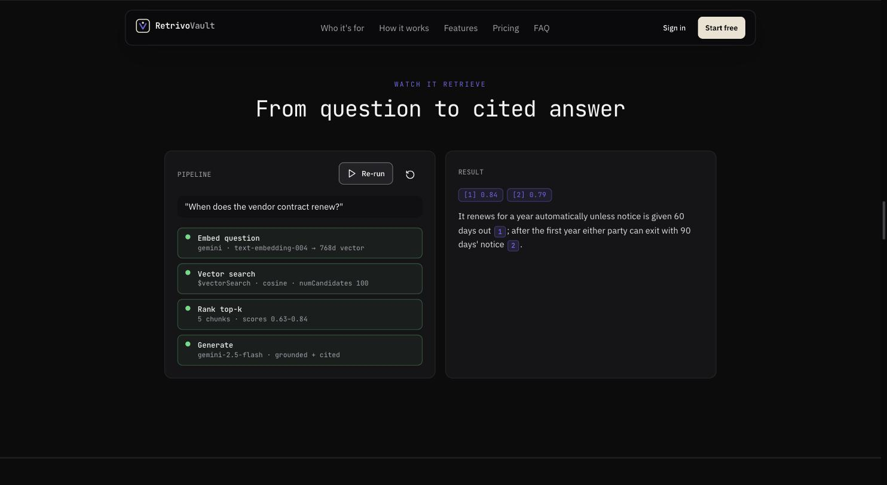
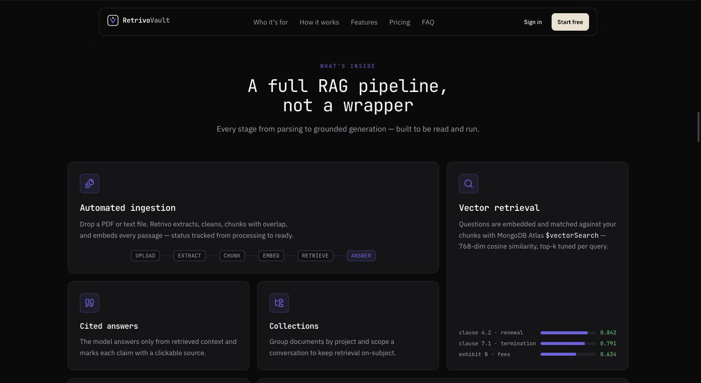
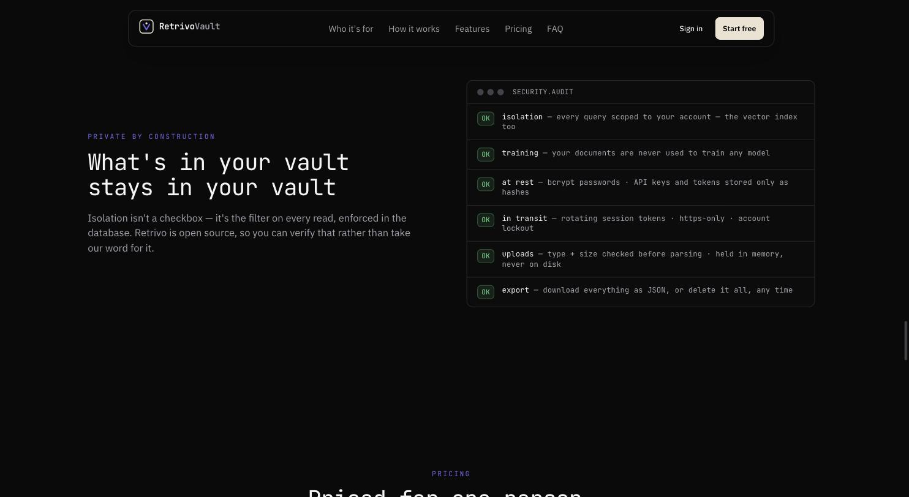
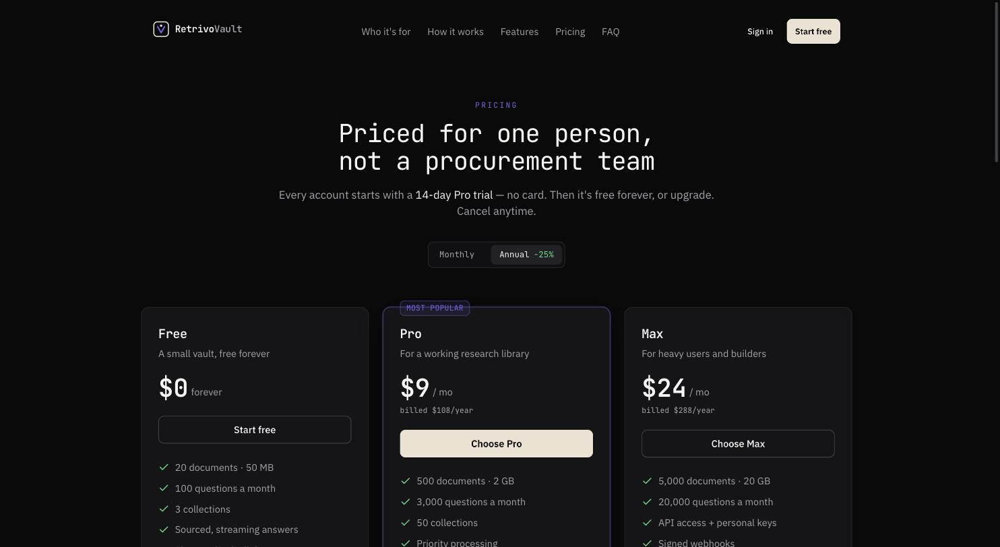
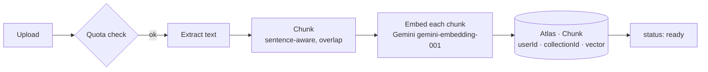
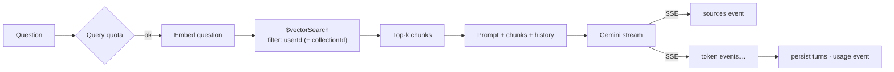

<div align="center">

# Retrivo Vault

**The research assistant that only knows what you've read.**

A production-grade, individual-focused Retrieval-Augmented Generation (RAG) SaaS.
Upload your contracts, papers and notes, ask questions in plain language, and get
answers that cite the exact passage they came from — nothing else, nothing invented.

[](https://github.com/Ahmadhsn1/Rag-saas-RetrivoVault/actions/workflows/ci.yml)
[](./LICENSE)
[](https://nodejs.org)
[](./CONTRIBUTING.md)

[Quick start](#quick-start) · [Architecture](#architecture) · [Why I built this](#why-i-built-this) · [Engineering notes](#engineering-notes) · [Admin console](#admin-console) · [Security](#security)

</div>

---

> Individuals only — no teams, workspaces, or org roles, by design.

Sign up (14-day Pro trial, no card), verify your email, drop your documents (PDF ·
TXT · Markdown · DOCX · CSV · **web pages by URL**) into a private vault, and ask it
anything through a streaming, citation-backed chat. Free / Pro / Max plans with
trial-aware quotas, Stripe billing, in-app + email + Web Push notifications, an
activity log + data export, personal API keys, HMAC-signed webhooks, an OpenAPI
spec, and an operator admin console (presence, complimentary grants, broadcasts,
audit log).

See [`docs/ARCHITECTURE.md`](./docs/ARCHITECTURE.md) for the full system design.

---

## Screens

<div align="center">



<sub><b>The promise, and the mechanism behind it</b> — the pipeline strip is on the hero on purpose: no magic, just the stages.</sub>

<br><br>



<sub><b>Question → cited answer.</b> Every stage reports itself, and the answer carries <code>[1] 0.84</code> / <code>[2] 0.79</code> match scores with clickable inline citations. If it isn't in your documents, Retrivo says so.</sub>

<br><br>

<table>
<tr>
<td width="50%"></td>
<td width="50%"></td>
</tr>
<tr>
<td align="center"><sub><b>A full RAG pipeline, not a wrapper</b> — every stage from parsing to grounded generation.</sub></td>
<td align="center"><sub><b>Private by construction</b> — isolation is the filter on every read, enforced in the database.</sub></td>
</tr>
</table>



<sub><b>Priced for one person, not a procurement team</b> — every account starts on a 14-day Pro trial, no card.</sub>

</div>

---

## Why I built this

Everyone who works with documents ends up with the same pile: contracts, papers,
transcripts, reports — saved "for later," and later never comes. The pile doesn't
get smarter as it grows, it just gets heavier. Keyword search fails the moment you
don't remember the exact wording, and pasting a file into a general chatbot loses
everything the moment you close the tab — no memory across documents, no way to
check where an answer came from, and your text goes wherever that vendor's model
goes.

I wanted something narrower and more honest: a tool that only answers from what
you've actually given it, that shows the passage behind every claim instead of
asking you to trust it, and that says "not in your documents" instead of guessing.
Building it individual-only — no teams, no seats, no org roles gating features
behind a sales call — was a deliberate constraint, not a missing feature: it kept
the isolation model simple enough to reason about and verify, chunk by chunk. (The
admin console is for whoever *runs* an instance — presence, support, broadcasts —
not a tenant-management layer.)

That constraint is also why the whole system stays small enough to read end to end:
one ingestion pipeline, one retrieval path, one `userId` filter that every query
passes through. No hidden multi-tenant complexity to hide bugs in.

## Architecture

**Ingestion** — every document goes through the same pipeline, queued so a 200-page
PDF can't block anyone else's upload:



**Query** — a question never sees another user's documents; isolation is enforced
at the database index, not just in application code:



Full component breakdown, data models, and folder structure:
[`docs/ARCHITECTURE.md`](./docs/ARCHITECTURE.md).

## Engineering notes

The parts that were harder than they looked, what the code actually does, and what
I traded away. File references are real — the whole pipeline is small enough to read.

### Isolation is enforced by the index, not by the query

The premise of a private vault collapses if one person's question can ever retrieve
another person's chunk. Checking `userId` in application code is easy to get right
once and easy to forget the next time someone adds a retrieval path, so the filter
is part of the Atlas Vector Search index definition itself:

```json
{ "fields": [
  { "type": "vector", "path": "embedding", "numDimensions": 768, "similarity": "cosine" },
  { "type": "filter", "path": "userId" },
  { "type": "filter", "path": "collectionId" }
]}
```

`retrieveChunks()` then passes `filter: { userId }` into `$vectorSearch`
([`services/retrievalService.js`](./backend/src/services/retrievalService.js)) —
the filter is applied *inside* the ANN search, not as a `$match` afterwards. That
distinction matters: post-filtering would let another user's vectors consume the
top-k slots and silently shrink your recall to near zero, while pre-filtering keeps
the candidate pool entirely within your own chunks.

The related tuning knob is `numCandidates: Math.max(topK * 20, 100)`. Atlas's HNSW
search is approximate; the ratio of candidates to returned results is the
recall/latency dial. 20× at `topK = 5` means 100 candidates explored to return 5 —
enough that the filter never starves the result set, cheap enough to stay well
inside interactive latency.

Two adversarial test suites exist purely to keep trying to cross this boundary.

### Chunking: a three-tier cascade, because real documents are hostile

Fixed-size chunking cuts mid-sentence and strands the subject of a clause in a
different vector from its object, which wrecks retrieval quality. But you cannot
*only* split on semantic boundaries either — a 4 MB single-line CSV or a minified
export has no boundaries at all.
[`services/chunkingService.js`](./backend/src/services/chunkingService.js) degrades
in three tiers: paragraphs (`\n{2,}`) → sentences (`/[^.!?]+[.!?]*\s*/g`) → a
fixed-width `hardSplit()` for any run that still exceeds the target. Each tier only
runs when the one above it fails to get under `CHUNK_SIZE` (default 1000).

Overlap (default 150) is carried by seeding the next buffer with the tail of the
flushed chunk — `buffer = trimmed.slice(-overlap)` — so a fact that straddles a
boundary appears in full in at least one chunk. The cost is honest: ~15% duplicated
text, which is storage and embedding spend traded for not losing answers to a
boundary.

`MAX_CHUNKS_PER_DOC` (4000) is a hard ceiling. Without it, one pathological input
becomes thousands of embedding calls and a bill.

### Refresh-token reuse detection needs a grace window, or it logs people out

Rotating a refresh token on every use is the easy half. The hard half is what to do
when an *already-rotated* token is presented: that either means the token was stolen
and replayed, or it means the legitimate client retried.

[`services/refreshTokens.js`](./backend/src/services/refreshTokens.js) groups tokens
into a `family` (a UUID minted at login). On rotation it stamps `rotatedAt`. If a
token that already has `rotatedAt` comes back, the age decides:

- **within `REPLAY_GRACE_MS` (15s)** → treated as a client retry. React StrictMode
  double-mounts in dev, and a flaky network will resend a refresh whose response was
  lost. Issue a sibling token in the same family; revoke nothing.
- **older than 15s** → genuine reuse. `updateMany` revokes the *entire family*, not
  just that token, so the attacker and the victim are both cut off and the real user
  is forced to re-authenticate.

Getting this wrong in either direction is bad: no grace window means users get
randomly logged out by their own retries; no reuse detection means a stolen token
stays valid for its whole TTL. Fifteen seconds is the compromise — far longer than
any legitimate retry, far shorter than a useful attack window.

### Presence is a separate model, and "online" is a computed property

The admin console needs two things the refresh-token table can't cleanly give: a
durable record of every sign-in (the token rows are TTL-purged a week after expiry),
and a "last active" signal that a token rotation every 15 minutes is too coarse for.
[`models/UserSession.js`](./backend/src/models/UserSession.js) is one row per device,
keyed to the refresh-token `family` so [`services/presence.js`](./backend/src/services/presence.js)
can open it at login, bump `lastSeenAt` on rotation, and close it on logout — all
fire-and-forget, because presence must never be able to break auth. The browser adds a
60-second heartbeat (`POST /api/presence/ping`) that pauses on a hidden tab.

"Online" is never stored — it's `endedAt == null && lastSeenAt > now - PRESENCE_WINDOW`,
computed at read time. That means a killed tab simply ages out of the online list on
its own; a scheduler sweep only exists to backfill `endedAt` on abandoned rows so the
duration stats stay honest. Storing a boolean would have needed a writer for the
"went offline" transition that, by definition, no longer has a client to send it.

### The admin account is provisioned, never seeded into the repo

A public repo can't ship an admin login — the first person to clone it would own every
deployment. [`services/adminBootstrap.js`](./backend/src/services/adminBootstrap.js)
reads `ADMIN_EMAIL` / `ADMIN_PASSWORD` once at boot, creates or repairs exactly one
`isRootAdmin` account, hashes the password with bcrypt, and drops the plaintext — it's
never logged, and production refuses to start if it's weak. `npm run seed:admin` runs
the same path on demand to rotate it. The root account is then load-bearing in a way
the API enforces: `loadTarget()` refuses to suspend, demote or delete it, and role
changes are gated behind a `requireRootAdmin` that only that account passes.

### Streaming breaks the assumptions of centralized error handling

Express error handling assumes you can still set a status code when something fails.
The moment an SSE response has flushed its first token, that assumption is false —
headers are gone, and trying to send a JSON error throws a second error inside the
handler for the first.
[`middleware/errorHandler.js`](./backend/src/middleware/errorHandler.js) checks
`res.headersSent` before anything else and, if the response is already in flight,
just calls `res.end()` to close the stream cleanly.

The same boundary changes retry semantics.
[`services/generationService.js`](./backend/src/services/generationService.js) wraps
only the *initial* `generateContentStream()` call in `withRetry` — once tokens are
flowing you cannot transparently restart, because the client has already rendered a
partial answer. Retry before first byte, fail forward after it.

Everything that isn't streaming gets normalized in that one handler: malformed JSON
(`entity.parse.failed`), oversized bodies, multer's `LIMIT_FILE_SIZE`, Mongoose
`CastError` on a bad ObjectId, duplicate-key `11000`, and stray JWT errors all map
to a 4xx. The rule the adversarial suite enforces: **no malformed input may ever
produce a 500.** In production, non-operational 5xx messages are replaced entirely
so internals never reach a client.

### Retry classification, and not synchronizing every client

[`utils/retry.js`](./backend/src/utils/retry.js) retries only what is actually
transient — HTTP 429/503 and timeout/reset signatures — and throws immediately on
everything else, because retrying a deterministic 400 just multiplies load.

Backoff is `min(baseMs * 2^(attempt-1), maxMs)` multiplied by random jitter in
`0.7–1.3×`. The jitter is the point: without it, every client that hit the same
upstream rate limit retries at the same instant and rebuilds the spike that caused
the failure.

### Backpressure: the queue refuses work it cannot finish

Ingestion is the expensive path — parse, chunk, then one embedding call per chunk.
[`services/jobQueue.js`](./backend/src/services/jobQueue.js) is a small in-process
queue with bounded concurrency (`INGEST_CONCURRENCY`, default 2), so a 200-page PDF
cannot monopolize the event loop or the embedding quota.

- **Priority** is an ordered insert (`findIndex(j => j.priority < priority)`) — higher
  priority first, FIFO within a level. Paid plans enqueue at priority 10.
- **Retries** use the same exponential backoff, and the `setTimeout` is `.unref()`d
  so a pending retry never keeps the process alive at shutdown.
- **Depth is capped** at `MAX_QUEUE_DEPTH` (500). Past that, uploads are rejected with
  a `503` rather than accepted into a queue that will never drain. Refusing work
  loudly beats accepting it and failing silently an hour later.

The public surface is deliberately three functions (`enqueue`, `registerHandler`,
`queueStats`) so this module can be swapped for BullMQ + Redis when one process stops
being enough. That is the known limit of this design, and it is documented rather
than hidden.

### Untrusted input reaches Mongo *and* the network — two problems, two fixes

**Into the database.** [`middleware/sanitize.js`](./backend/src/middleware/sanitize.js)
strips `$`-prefixed and dotted keys from body, query, and params, with a recursion
depth cap of 8 so a deeply nested payload can't burn CPU in the sanitizer itself.
But stripping operators is not sufficient on its own — `{ email: { $ne: null } }`
becomes `{ email: {} }`, which is still not a string. So call sites additionally
coerce: `str()` returns `""` for anything that isn't a string, and `asId()` validates
ObjectIds before they reach a query. Sanitize *and* coerce; either alone leaves a gap.

**Out to the network.** Personal webhooks are user-supplied URLs by design, which
makes them a textbook SSRF vector — a "webhook" pointed at `169.254.169.254` is a
cloud credential-metadata read.
[`utils/safeUrl.js`](./backend/src/utils/safeUrl.js) requires HTTPS and blocks
loopback, RFC 1918 (`10/8`, `172.16–31/12`, `192.168/16`), link-local `169.254/16`,
and IPv6 `fc/fd/fe80` ranges. Delivery uses `redirect: "error"`, because a public URL
that 302s to internal metadata would otherwise walk straight through a naive check.

### Grounding is a prompt contract, not a hope

[`services/generationService.js`](./backend/src/services/generationService.js) numbers
every retrieved passage `[1]…[n]` and instructs the model to answer *only* from them,
cite inline with those numbers, and explicitly say when the answer isn't in the
documents. Because the numbering in the prompt matches the chunk order handed to the
client, `[1]` in the streamed text resolves to a real chunk id — citations are
clickable and verifiable rather than decorative.

History is capped at the last 6 turns. Unbounded history steadily crowds retrieved
context out of the window, so the model starts answering from the conversation
instead of from your documents — the exact failure the product exists to avoid.

### Trial, paid, comped and free are one function, called everywhere

"Paid," "on an active trial," "given complimentary access by an admin," and "never
subscribed" are four states that every quota check needs a single answer from, and
duplicating that resolution at each call site is how limits quietly drift out of sync.
`user.effectivePlan()` resolves it once — paid > active comp grant > live trial > free
— and every guard in [`middleware/quota.js`](./backend/src/middleware/quota.js) calls
it. Adding the admin grant tier was one field on the model and one line in that
function; nothing downstream changed, because nothing downstream ever branched on the
plan itself. Over-limit responses carry a machine-readable `details.code`
(`quota_exceeded` / `feature_locked`) so the frontend can turn a 402/403 into a
specific upgrade prompt instead of a generic error toast.

### Pin the alias, not the version — models get retired

The embedding and generation model names were originally hard-coded to
`text-embedding-004` and `gemini-2.5-flash`. Google retires dated model names on
a schedule, and when both were pulled, `embedContent` started returning a bare
`404` — which surfaced as *every* ingestion failing with no obvious cause. The
defaults now point at Google's rolling aliases (`gemini-flash-latest`) and the
current GA embedding model (`gemini-embedding-001`), overridable per deployment
via env but never pinned by default.

`gemini-embedding-001` returns 3072-dim vectors and is only pre-normalized at
that full size, while the Atlas index and `Chunk` schema are built around 768.
So [`services/embeddingService.js`](./backend/src/services/embeddingService.js)
requests `outputDimensionality: 768` and L2-normalizes the result itself —
correct for cosine today, and correct if the index is ever switched to
dot-product.

### Local dev shouldn't need a cloud database

Atlas Vector Search doesn't exist in a local MongoDB, which made "clone it and look
around" require a real cluster and a Gemini key. With no `backend/.env`, the server
now starts an ephemeral in-memory MongoDB and runs in demo mode (auto-verified
emails, stubbed billing). Every route works except the two that genuinely cannot —
vector retrieval and model calls — and those fail with a clear `502` at the boundary
instead of a confusing connection error. The honest limitation is stated rather than
faked.

---

## Stack

| Layer | Tech |
|---|---|
| Frontend | React + Vite + **TypeScript**, Tailwind, shadcn/ui (Radix), React Router, GSAP, Recharts. Dark-only developer-tool aesthetic — OLED canvas, warm bone accent, monospace status chips; JetBrains Mono + IBM Plex Sans. |
| Backend | Node.js + Express (ESM), SSE streaming, pino logging |
| Database | MongoDB Atlas + Atlas Vector Search (`$vectorSearch`, 768-dim cosine) |
| AI | Google Gemini `gemini-embedding-001` + `gemini-flash-latest` |
| Auth | JWT access + **rotating** httpOnly refresh cookie · bcrypt · login lockout · session/device tracking · `x-api-key` |
| Notifications | In-app centre · Nodemailer (SMTP; console fallback) · **Web Push** (VAPID + service worker) |
| Billing | Stripe Checkout + Customer Portal + webhooks (degrades gracefully when unset) |
| Ingestion | In-process job queue (concurrency, priority, retry, backpressure) |
| Admin | Operator console — live presence, complimentary grants, broadcasts, immutable audit log |
| Tests / CI | Vitest (142 tests, incl. adversarial hardening suites) · GitHub Actions |
| Deploy | Docker + Docker Compose |

---

## Quick start

```bash
cd backend  && npm install && npm run dev     # :5000 — works with ZERO config
cd frontend && npm install && npm run dev     # :5173 — proxies /api -> :5000
```

**Zero-config dev:** with no `backend/.env`, `npm run dev` starts an **ephemeral
in-memory MongoDB** and runs in demo mode (emails auto-verified, billing stubbed).
Every endpoint works except **vector retrieval** (needs Atlas) and **AI calls**
(need a Gemini key) — you get a clear `502` there until you configure them.

**Real setup:** `cp backend/.env.example backend/.env`, fill in `MONGO_URI` (a MongoDB
**Atlas** cluster — Vector Search is Atlas-only), `GEMINI_API_KEY`, and JWT secrets, then
`cd backend && npm run create-index`.

**Admin access:** set `ADMIN_EMAIL` + `ADMIN_PASSWORD` (12+ chars) and the root admin
is created at boot; `npm run seed:admin` does the same on demand and rotates the
password. No credentials are baked into the repo — every deployment provisions its
own. `ADMIN_EMAILS=a@x.com,b@x.com` additionally promotes existing accounts.

**Checks:** `cd backend && npm test` · `cd frontend && npm run typecheck && npm run lint && npm test && npm run build`

### Routes

Marketing: `/` · `/pricing` · `/docs` · `/terms` · `/privacy` · `/s/:shareId` (public shared chat)
Auth: `/login` · `/signup` · `/forgot-password` · `/reset-password` · `/verify-email`
App: `/app` (Chat) · `/app/documents` · `/app/collections` ·
`/app/settings` (`?tab=profile|billing|notifications|keys|webhooks|activity|account`) ·
`/app/admin` (`?tab=overview|users|presence|broadcasts|audit`, admins only)

---

## Docker

```bash
cp backend/.env.example backend/.env      # fill in real values
docker compose up --build
docker compose run --rm backend npm run create-index   # once
```

App: http://localhost:8080 · API: http://localhost:5000/api. nginx serves the static
bundle and proxies `/api` (SSE-friendly). Containers run non-root with healthchecks.

---

## Plans & quotas

| | Free | Pro | Max |
|---|---|---|---|
| Documents · storage | 20 · 50 MB | 500 · 2 GB | 5,000 · 20 GB |
| Questions / month | 100 | 3,000 | 20,000 |
| Collections | 3 | 50 | 500 |
| BYO Gemini key · priority queue | — | ✓ | ✓ |
| API keys · webhooks · API access | — | — | ✓ |

Every signup gets a **14-day Pro trial**. `user.effectivePlan()` resolves the plan in
force — paid subscription > admin complimentary grant > live trial > free — and every
quota guard calls it. Over-limit requests return `402`/`403` with `details.code`
(`quota_exceeded` / `feature_locked`); the UI turns these into an "Upgrade" prompt.

---

## Admin console

`/app/admin` is an **operator** console — for whoever runs an instance, not a
tenant-management layer. The root admin is provisioned per deployment from
`ADMIN_EMAIL` / `ADMIN_PASSWORD` (nothing in the repo); it's protected from
suspension, demotion and deletion, and can promote or revoke other admins.

| Tab | What it does |
|---|---|
| **Overview** | online now, active today / this week, user + 30-day signup & query sparklines, MRR estimate, comped / suspended counts, push subscribers, and a live system-health panel (DB, queue, Stripe, SMTP, Web Push, Gemini) |
| **Users** | searchable, filterable table (online · comped · suspended · locked · admin), CSV export, and a per-user drawer |
| **Presence** | who's online right now, plus a recent-sessions feed with duration, device and IP |
| **Broadcasts** | send an announcement to an audience (everyone · a plan · comped · online now · active-7d · one user) over in-app + email + Web Push, with a live recipient count and delivery history |
| **Audit** | append-only log of every privileged action — who did what, to whom, from where |

From a user's drawer an admin can: **grant complimentary Pro/Max** (optional expiry
+ reason), suspend / reinstate, force sign-out on every device, **email a reset link**
or **issue a one-time temporary password** (shown once; forces a change on next
sign-in), and promote / revoke admin (root only).

Users get the matching self-service pieces in **Settings → Account**: an
active-devices list with per-device sign-out, a change-password form, and a Web Push
opt-in toggle.

---

## Optional integrations

- **Stripe** — `STRIPE_SECRET_KEY`, `STRIPE_WEBHOOK_SECRET`, four price IDs
  (`STRIPE_PRICE_{PRO,MAX}_{MONTHLY,ANNUAL}`). Local: `stripe listen --forward-to
  localhost:8080/api/billing/webhook`. Without a key, billing is disabled and everyone
  stays on Free.
- **Email** — `SMTP_URL`. Without it, emails print to the console.
- **Web Push** — `VAPID_PUBLIC_KEY` + `VAPID_PRIVATE_KEY` (`npm run seed:admin` prints
  a pair). Without them, admin broadcasts fall back to in-app + email only.
- **`DEMO_MODE=true`** — auto-verify emails, stub billing (portfolio demos).
- **Admin** — `ADMIN_EMAIL` + `ADMIN_PASSWORD` provision the root admin at boot;
  `ADMIN_EMAILS` promotes extra accounts; `PRESENCE_WINDOW_MIN` (default 2) tunes the
  "online" heartbeat window.

---

## API

Full surface in [`docs/ARCHITECTURE.md`](./docs/ARCHITECTURE.md) §7,
or the live spec at `GET /api/public/openapi.json` (rendered at `/docs`).
`/api/documents` and `/api/chat` also accept an `x-api-key` header (Max plan keys).

---

## Security

Rotating refresh tokens with reuse detection · per-account login lockout · suspended
accounts refused at login **and** token refresh · `helmet` · credentialed CORS · rate
limiting (auth/refresh/upload/chat) · **NoSQL-injection sanitizer** + string/id
coercion · every framework error mapped to a 4xx (no 500 on bad input) · webhook SSRF
protection (private/metadata hosts blocked) · ingestion input caps (text length, chunk
count, queue depth) · MIME + size checks before parsing, in-memory only · every query
scoped by `userId` (vector index included) · one-time tokens & keys stored as SHA-256
hashes, TTL-indexed · Stripe webhook signature verified against the raw body · no user
enumeration on password reset · pino logging with secret redaction · secrets via env.

**Admin** — the root account is provisioned from env (never committed) and protected
from suspension / demotion / deletion; role changes are root-only; every privileged
action is written to an append-only audit trail. Admin-issued temporary passwords are
single-use, hashed, never logged, and force a reset on next sign-in. Only the VAPID
*public* key is ever exposed; dead push subscriptions are pruned on send.

See [`SECURITY.md`](./SECURITY.md).

---

## Testing

142 automated tests, run on every push via GitHub Actions:

- **Backend (102 tests)** — Vitest + `mongodb-memory-server` + `supertest`, Gemini and
  `web-push` mocked. Covers auth + refresh-token rotation/reuse, login lockout, email/
  reset/change/delete flows, trial- and grant-aware quota enforcement, billing, API
  keys, webhooks + SSRF, notifications, chat feedback/share/pin, activity/export,
  ingestion end-to-end + input caps, the full admin console (bootstrap, grants,
  suspension, temp passwords, presence, broadcasts, audit, root-admin guard rails),
  and **two adversarial hardening suites** (malformed input never 500s, cross-user
  isolation, injection attempts).
- **Frontend (40 tests)** — Vitest + Testing Library (jsdom), GSAP + API mocked.
  Every route renders, including 404, error boundary, `/docs`, `/s/:id`, and the
  admin console (overview, users, live presence, broadcast send).

---

## Roadmap

- [ ] Redis-backed rate limiter for multi-instance deployments (in-memory store
      documented as single-instance in [`SECURITY.md`](./SECURITY.md))
- [ ] Swappable ingestion queue backend (BullMQ + Redis) for horizontal scaling
- [ ] Additional file types (EPUB, HTML export)

Tracked as GitHub issues — see [Issues](https://github.com/Ahmadhsn1/Rag-saas-RetrivoVault/issues).

---

## Contributing

Bug reports, feature ideas and PRs are welcome — see [`CONTRIBUTING.md`](./CONTRIBUTING.md).
Please also read the [Code of Conduct](./CODE_OF_CONDUCT.md). Release notes live in
[`CHANGELOG.md`](./CHANGELOG.md).

## License

MIT — see [`LICENSE`](./LICENSE). Copyright © 2026 Retrivo Vault contributors.
